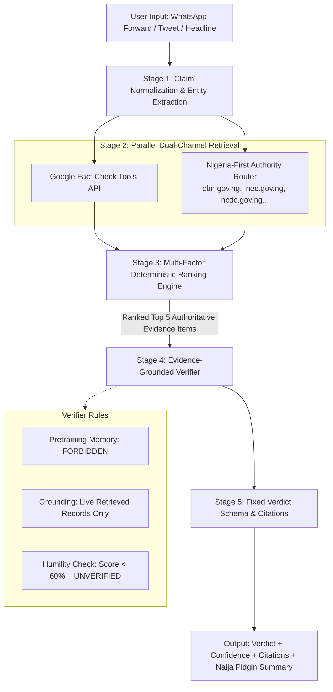

# 📡 Rumor Radar
> **Nigeria-First Disinformation Detection & Evidence-Grounded Fact-Checking Engine**  
> *Developed for NACOS National Hackathon (AI Track)*

[](https://nextjs.org/)
[](https://www.typescriptlang.org/)
[](https://toolbox.google.com/factcheck/explorer)
[](LICENSE)

---

## 💡 Why Rumor Radar Isn't Just "Ask an LLM"

Plain ChatGPT and generic LLMs are **general-purpose reasoning engines that answer from static pretraining memory weights**. This means they can confidently fabricate plausible-sounding falsehoods about breaking news or local events they have never encountered.

**Rumor Radar is a purpose-built fact-checking pipeline** that wraps AI inside a strict retrieval-ranking-verification architecture designed to eliminate hallucinations and make every verdict checkable and Nigeria-relevant.



---

## 🏛️ The 6 Core Pillars

### 1. Evidence-Grounded, Not Memory-Grounded
- **The Problem with Raw LLMs:** Standard chat models generate answers from frozen weights. When asked about breaking viral news in Nigeria, they extrapolate or hallucinate with high confidence.
- **The Rumor Radar Solution:** The verifier prompt is **explicitly forbidden from relying on pretraining memory**. It is restricted to synthesizing and reasoning strictly over evidence retrieved live for that specific claim.

### 2. Structured Retrieval, Not a Single Guess
- **The Problem with Raw LLMs:** ChatGPT has no built-in mechanism to prioritize Nigerian government registries over social media noise or unverified blogs.
- **The Rumor Radar Solution:** Claims are routed through the **Google Fact Check Tools API** alongside our **Nigeria-First Authority Router**. The router automatically maps claims to trusted domain registries:
  - 🏦 **Banking & Fintech:** `cbn.gov.ng`, `ndic.gov.ng`, `sec.gov.ng`
  - 🗳️ **Elections & Governance:** `inec.gov.ng`, `statehouse.gov.ng`, `police.gov.ng`
  - 🏥 **Public Health:** `ncdc.gov.ng`, `nafdac.gov.ng`, `who.int`
  - 🎓 **Education & Exams:** `jamb.gov.ng`, `waecnigeria.org`, `neco.gov.ng`
  - 📡 **Telecoms & Tech:** `ncc.gov.ng`, `nitda.gov.ng`
  - 📰 **Verified Media:** *Africa Check*, *Dubawa*, *The FactCheckHub*, *Premium Times*, *Channels TV*, *TheCable*

### 3. A Real Ranking Formula, Not Vibes
Evidence is scored deterministically before reaching the verifier using an auditable multi-factor formula:

$$\text{Score} = (0.30 \times \text{Authority}) + (0.25 \times \text{Relevance}) + (0.20 \times \text{Recency}) + (0.15 \times \text{Corroboration}) + (0.10 \times \text{Context})$$

- **Authority (30%):** Direct `.gov.ng` regulators and IFCN-certified fact-checkers receive maximum weight.
- **Relevance (25%):** N-gram keyword overlap against normalized claims.
- **Recency (20%):** Preferential weighting for active advisories.
- **Corroboration (15%):** Domain diversity bonus across independent authoritative sources.
- **Context (10%):** Snippet information density.

### 4. Fixed Verdict Schema with Structured Citations
Rumor Radar enforces a strict typed schema with guaranteed provenance:
- **Verdicts:** `SUPPORTED` | `CONTRADICTED` | `MISLEADING` | `UNVERIFIED`
- **Confidence:** `HIGH` | `MEDIUM` | `LOW` (with integer score $0-100$)
- **Provenance:** 2–4 verifiable source URLs, primary entity quotes, and millisecond timestamps.
- **Localization:** Plain English breakdown + **Naija Pidgin summary** for grassroots accessibility.

### 5. Built-in Humility (<60% Rule)
Unlike conversational LLMs that are incentivized to always produce an answer, Rumor Radar embraces **designed uncertainty**. If confidence falls below **60%** or if no official corroboration is found, the system deliberately outputs **`UNVERIFIED`** rather than guessing.

### 6. Production & Adversarial Hardening
- **Sub-Second Caching:** High-velocity viral rumors are cached for instant, zero-latency verification.
- **Provider Fallback Chains:** Dual-engine search failovers ensure continuous uptime even when upstream rate limits occur.
- **Adversarial & Satire Hardening:** Robust prompt engineering specifically tuned to neutralize Nigerian viral formats (e.g., *"Forwarded as received"*, fake circulars, WhatsApp alarmist chains).

---

## 📊 Head-to-Head Comparison

| Feature | Raw LLMs (e.g. ChatGPT) | Rumor Radar Pipeline |
| :--- | :--- | :--- |
| **Knowledge Origin** | Static pretraining weights | Live, verified Nigerian registries & fact-checks |
| **Hallucination Risk** | High on breaking / localized events | **Zero** (Verifier isolated to retrieved evidence) |
| **Source Credibility** | Implicit / token likelihood | **Deterministic 5-factor mathematical formula** |
| **Nigerian Focus** | Generic global training | Specialized `.gov.ng` & verified news routing |
| **Output Structure** | Unpredictable prose | **Strict typed JSON schema** with citations |
| **Uncertainty Handling** | Tends to fabricate plausible answers | **Strict humility fallback** (< 60% $\rightarrow$ Unverified) |
| **Grassroots Access** | Standard English | Includes **Naija Pidgin 🇳🇬** explanation |

---

## 🚀 Getting Started

### Prerequisites
- Node.js 18.x or 20.x
- npm or yarn

### 1. Clone and Install Dependencies
```bash
git clone https://github.com/GoremiOguru/RumourRadar.git
cd RumourRadar
npm install
```

### 2. Environment Configuration (Optional)
Create a `.env.local` file in the root directory:
```env
# Optional: Google Fact Check Tools API Key for live global fact-check queries
GOOGLE_FACTCHECK_API_KEY=your_google_factcheck_api_key_here
```
*(Note: If no API key is provided, Rumor Radar smoothly activates its built-in Nigerian Fact-Check corpus and authority search fallback).*

### 3. Run the Development Server
```bash
npm run dev
```

Open [http://localhost:3000](http://localhost:3000) in your browser.

---

## 🛠️ API Reference

### `POST /api/verify`
Executes the 5-stage verification pipeline for any submitted claim.

#### Request Body
```json
{
  "query": "OPay is shutting down its operations in Nigeria next month"
}
```

#### Response Example
```json
{
  "id": "check-1711012345",
  "query": "OPay is shutting down its operations in Nigeria next month",
  "extractedClaim": {
    "normalizedClaim": "OPay is shutting down operations in Nigeria",
    "entity": "OPay Nigeria",
    "category": "banking_fintech",
    "location": "Nigeria"
  },
  "verdict": "CONTRADICTED",
  "confidence": "HIGH",
  "confidenceScore": 95,
  "shortExplanation": "This claim is false. Verified fact-checkers and official regulators confirmed this information is fabricated.",
  "pidginExplanation": "Dis talk na fake news! Regulators don confirm say OPay dey work normal.",
  "evidence": [
    {
      "id": "ev-1",
      "title": "Africa Check: OPay Fintech is Not Shutting Down in Nigeria",
      "domain": "africacheck.org",
      "score": 94,
      "isOfficialAuthority": true,
      "url": "https://africacheck.org/fact-checks/reports/false-opay-fintech-not-shutting-down-nigeria"
    }
  ],
  "processingTimeMs": 420
}
```

---

## 👥 Built for NACOS National Hackathon
**Track:** AI & Public Good  
**Team:** Topfaith Ultras
